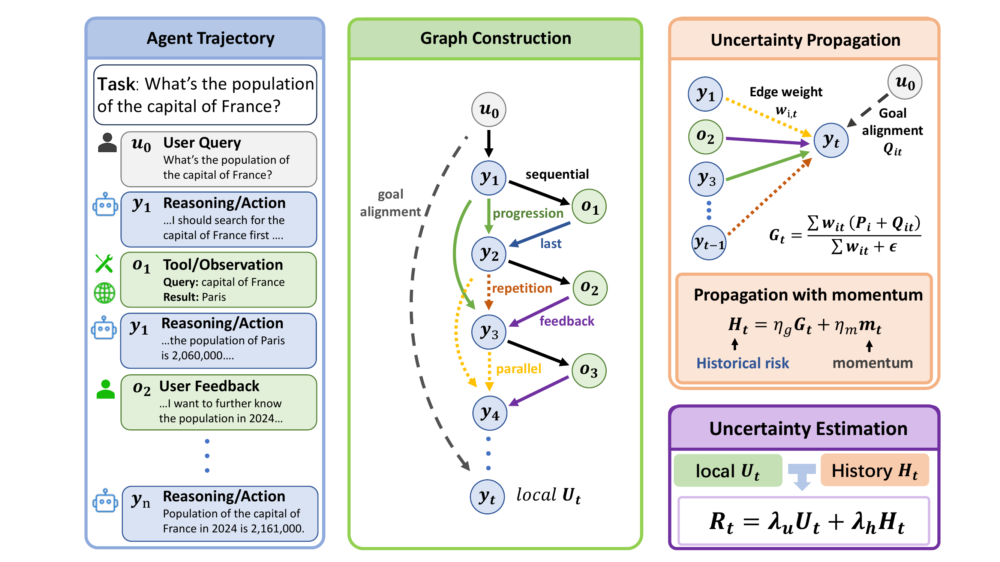
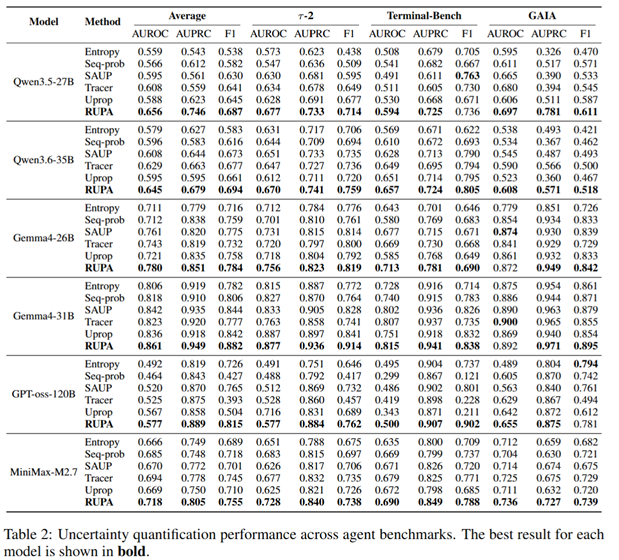

# RUPA

This repository provides the code implementation for **FROM SEQUENCE TO STRUCTURE: RELATIONAL UNCERTAINTY PROPAGATION FOR LLM AGENTS**.

RUPA (Relational Uncertainty Propagation for Agents) is a graph-based uncertainty quantification framework for long-horizon LLM agents. It estimates failure risk by constructing relational graphs over agent trajectories and propagating uncertainty through logical, temporal, and feedback-dependent edges.

## Overview

Method overview ([PDF](assets/Method.pdf)):



Main experimental results:



## Repository Layout

```text
.
├── agent-tracer/                 # tau2 simulator and core RUPA metric code
│   └── src/tau2/metrics/
│       └── trajectory_tau.py      # RUPA graph construction and scoring
├── assets/                       # paper figures
│   ├── Method.pdf
│   ├── Method.png
│   └── Result.png
├── scripts/
│   ├── analysis/                 # empirical analysis scripts
│   ├── evaluation/               # metric evaluation, prefix curves, ablations
│   ├── harbor/                   # Harbor sampling agents and runner scripts
│   └── plotting/                 # plotting scripts for paper figures
├── requirements.txt
└── README.md
```

## 1. Environment Setup

### 1.1 Create a Python environment

```bash
python -m venv .venv
source .venv/bin/activate
```

### 1.2 Install dependencies

Install dependencies from the repository-level requirements file:

```bash
pip install -r requirements.txt
```

The editable `agent-tracer` package is included in `requirements.txt`, so the `tau2` command is installed together with the analysis dependencies.

## 2. Harbor Task Execution and Sampling

After configuring model API credentials in the environment or `.env` file, run a standard Harbor task with:

```bash
harbor run \
  --dataset terminal-bench/terminal-bench-2 \
  --agent terminus2 \
  --model MODEL_NAME \
  --force-build \
  --yes
```

To run the uncertainty-guided Harbor sampling agent used by this repository:

```bash
export OPENAI_API_KEY=YOUR_KEY
export OPENAI_BASE_URL=YOUR_BASE_URL
bash scripts/harbor/run_harbor_uncertainty_agent.sh \
  --dataset terminal-bench/terminal-bench-2 \
  --model MODEL_NAME \
  --force-build \
  --yes
```

The wrapper uses `scripts.harbor.harbor_uncertainty_agent:UncertaintySamplingTerminus2` and supports these common environment variables:

```bash
export UNCERTAINTY_METHOD=trajectory_tau
export UNCERTAINTY_NUM_SAMPLES=3
export UNCERTAINTY_TEMPERATURE=0.7
export HARBOR_AGENT_MAX_TURNS=80
```

You can also call Harbor directly:

```bash
harbor run \
  --dataset terminal-bench/terminal-bench-2 \
  --agent-import-path scripts.harbor.harbor_uncertainty_agent:UncertaintySamplingTerminus2 \
  --model MODEL_NAME \
  --agent-kwarg num_samples=3 \
  --agent-kwarg uncertainty_method=trajectory_tau \
  --agent-kwarg temperature=0.7 \
  --force-build \
  --yes
```

Generated trajectories and logs should be kept outside version control. The default `.gitignore` excludes `jobs/`, logs, caches, and intermediate result files.

## 3. Confidence Result Analysis

All confidence-analysis scripts expect a Harbor job root containing `result.json` and per-trial subdirectories.

### 3.1 Run all confidence metrics

```bash
bash scripts/evaluation/run_all_gaia_eval_metrics.sh PATH_TO_JOB_ROOT [python_bin]
```

This evaluates entropy, sequence probability, UProp, TRACER, SAUP, TAU, and RUPA.

### 3.2 Run individual confidence metrics

```bash
python scripts/evaluation/evaluate_gaia_entropy_metrics.py PATH_TO_JOB_ROOT
python scripts/evaluation/evaluate_gaia_sequence_prob_metrics.py PATH_TO_JOB_ROOT
python scripts/evaluation/evaluate_gaia_uprop_metrics.py PATH_TO_JOB_ROOT
python scripts/evaluation/evaluate_gaia_tracer_metrics.py PATH_TO_JOB_ROOT
python scripts/evaluation/evaluate_gaia_saup_metrics.py PATH_TO_JOB_ROOT
python scripts/evaluation/evaluate_gaia_tau_metrics.py PATH_TO_JOB_ROOT
python scripts/evaluation/evaluate_gaia_trajectory_tau_metrics.py PATH_TO_JOB_ROOT
```

### 3.3 Prefix confidence curves

Save prefix evaluation results:

```bash
python scripts/analysis/evaluate_prefix_uq_curves.py \
  PATH_TO_JOB_ROOT \
  --mode percent \
  --prefix-percents 0.1,0.2,0.3,0.5,0.7,1.0

python scripts/analysis/evaluate_prefix_uq_curves.py \
  PATH_TO_JOB_ROOT \
  --mode steps \
  --prefix-steps 1,2,4,8,12,16
```

Plot AUROC or AUPRC curves:

```bash
python scripts/plotting/plot_prefix_uq_curves.py \
  PATH_TO_JOB_ROOT/prefix_uq_curves_percent.json \
  --metric auroc

python scripts/plotting/plot_prefix_uq_curves.py \
  PATH_TO_JOB_ROOT/prefix_uq_curves_steps.json \
  --metric auprc
```

## 4. Notes

- All uncertainty metrics are evaluated as failure-detection scores: higher values indicate higher failure risk.
- RUPA's core implementation is in `agent-tracer/src/tau2/metrics/trajectory_tau.py`.
- Harbor sampling code is in `scripts/harbor/`.
- Evaluation outputs and generated plots are written under the provided job root unless an output path is specified.
